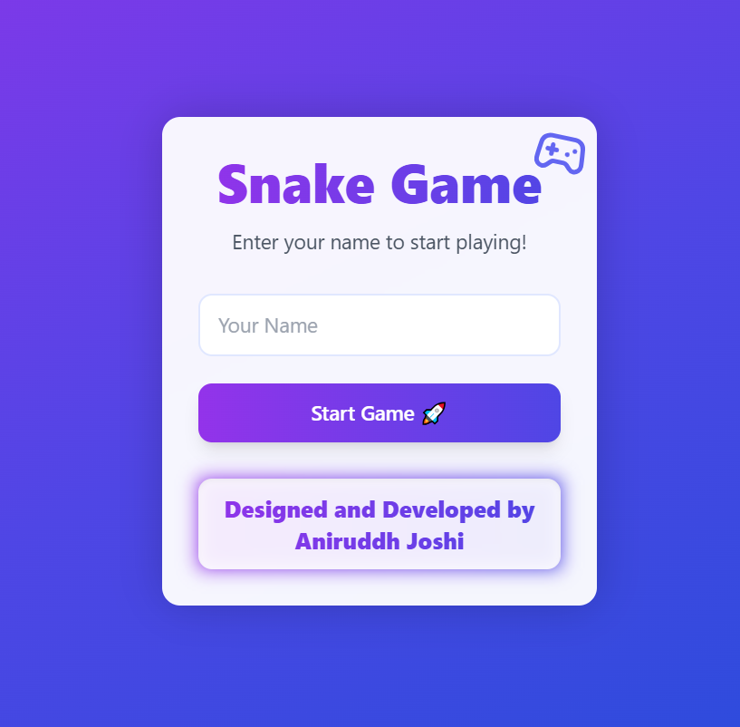
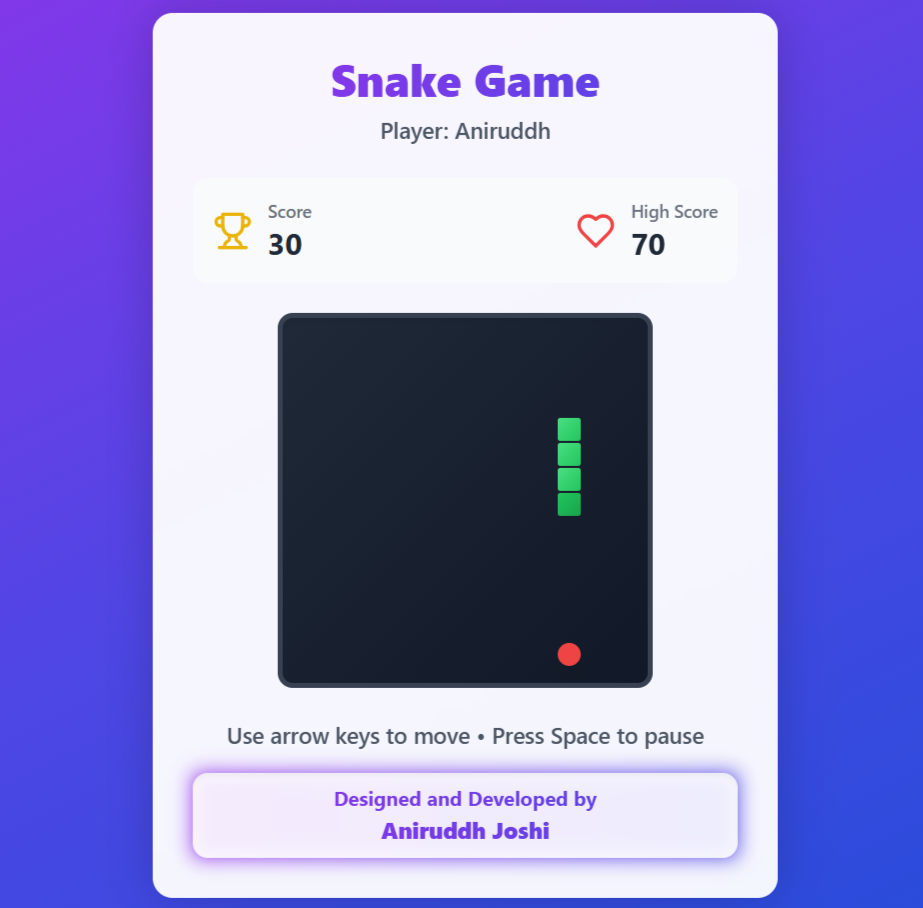

# 🐍 Modern Responsive Snake Game

A modern, responsive Snake Game built using **React** and **TypeScript**, featuring a polished and engaging user interface. The project utilizes **Vite** for fast development and optimized production builds, along with **Tailwind CSS** and **Lucide React** for styling and high-quality icons.

---

## 🎮 Live Demo
🚀 [Play the Snake Game Now](https://aniruddh-snake-game.netlify.app/)

📂 [GitHub Repository](https://github.com/aniruddh-joshi/Project-Snake_Game)

---

## ✨ Features
✅ **Modern UI** - Sleek design with a beautiful color scheme and animations  
✅ **Cross-Platform** - Playable on both desktop and mobile devices  
✅ **Keyboard & Touch Controls** - Supports arrow keys and swipe gestures  
✅ **Score Tracking & High Score Persistence**  
✅ **Pause Functionality**  
✅ **Smooth Animations & Gradient Backgrounds**  
✅ **Responsive Design** - Adapts to different screen sizes  
✅ **Dynamic Speed Adjustment** - Game speed increases as score rises  
✅ **Collision Detection & Boundary Checking**  

---

## 🛠️ Tech Stack
- **React + TypeScript** - For strong typing and maintainability
- **Vite** - Superfast development and build tool
- **Tailwind CSS** - Responsive and efficient styling
- **Lucide React** - Beautiful UI icons
- **React Hooks** - Efficient game state management

---

## 📸 Screenshots
<div align="center">
  
  
</div>

---

## 🚀 Installation & Running Locally
```sh
# Clone the repository
git clone https://github.com/aniruddh-joshi/Project-Snake_Game.git
cd Project-Snake_Game

# Install dependencies
npm install

# Start the development server
npm run dev
```

---

## 🎮 Controls
| Device  | Controls |
|---------|----------|
| Desktop | Arrow Keys (⬆️⬇️⬅️➡️) |
| Mobile  | Swipe Gestures |

---

## 💡 Future Enhancements
- 🎵 **Add Background Music & Sound Effects**
- 🏆 **Leaderboard Integration**
- 🎨 **Custom Themes & Skins**
- 🌍 **Multiplayer Mode**

---

## 👨‍💻 Designed & Developed By
**Aniruddh Joshi** 🚀

Give this project a ⭐ if you liked it! 😊
